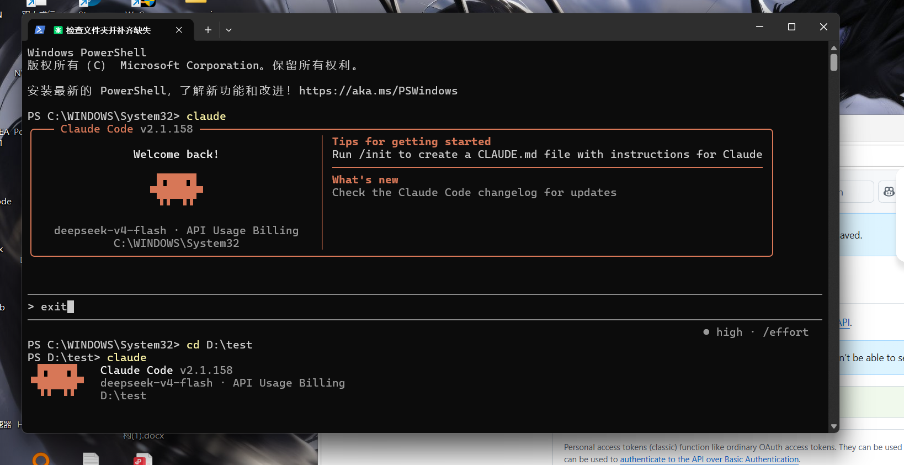

# Claude Code 中国安装配置指南 🇨🇳

> 让 Claude Code 在中国大陆网络环境下顺畅运行的完整解决方案。

[](https://github.com/skbb1v66-png/claude-code-cn)
[](LICENSE)

## 📖 项目介绍

Claude Code 是 Anthropic 官方推出的命令行 AI 编程助手，但在中国大陆网络环境下，默认安装和使用会遇到**网络连接失败**、**API 访问超时**、**依赖安装缓慢**等诸多问题。



本项目提供了一套**开箱即用**的解决方案：
- ✅ 自动检测系统环境
- ✅ 配置国内镜像源 / 代理
- ✅ 一键安装 Claude Code CLI
- ✅ 集成 DeepSeek API（国内可直接访问）
- ✅ 自动修复 PATH 与权限问题
- ✅ MCP（Model Context Protocol）工具安装

## ✨ 功能特性

| 特性 | 说明 |
|------|------|
| 🪟 Windows 支持 | PowerShell 脚本一键安装，自动配置环境变量 |
| 🐧 WSL 支持 | Linux 子系统专用脚本，兼容 Ubuntu/Debian |
| 🌐 网络优化 | 自动检测并配置代理 / 镜像源 |
| 🔑 API 集成 | 支持 DeepSeek API 及 OpenAI 兼容接口 |
| 🛠 MCP 工具 | 自动安装常用 MCP 服务器 |
| 📦 依赖管理 | 自动检测 Node.js、Python、Git 等依赖 |
| 🩺 故障诊断 | 内置网络检测、路径修复、权限修复 |

## 🚀 一键安装

### Windows（PowerShell）

以**管理员身份**打开 PowerShell，执行：

```powershell
irm https://raw.githubusercontent.com/skbb1v66-png/claude-code-cn/main/setup/install_claude_windows.ps1 | iex
```

或者克隆到本地后执行：

```powershell
# 克隆仓库
git clone https://github.com/skbb1v66-png/claude-code-cn.git
cd claude-code-cn

# 执行安装（建议以管理员身份运行）
.\setup\install_claude_windows.ps1
```

### WSL / Linux

```bash
# 克隆仓库
git clone https://github.com/skbb1v66-png/claude-code-cn.git
cd claude-code-cn

# 执行安装
chmod +x setup/install_claude_wsl.sh
./setup/install_claude_wsl.sh
```

## 🔧 配置 DeepSeek API

Claude Code 默认使用 Anthropic 官方 API，国内访问不稳定。推荐切换到 **DeepSeek API**：

### 方式一：使用配置脚本

```powershell
# Windows
.\scripts\start_claude.ps1 -Provider deepseek -ApiKey "你的真实API-Key"
```

```bash
# WSL
./scripts/start_claude.sh -p deepseek -k "你的真实API-Key"
```

### 方式二：手动配置

1. 复制配置模板：
```bash
cp setup/claude_config.template.json ~/.claude/settings.json
```

2. 编辑 `~/.claude/settings.json`，填入你的 API Key：
```json
{
  "apiKey": "你的真实API-Key",
  "model": "deepseek-chat",
  "apiBaseUrl": "https://api.deepseek.com/v1"
}
```

3. 获取 DeepSeek API Key：[platform.deepseek.com](https://platform.deepseek.com/)

### 方式三：环境变量

```bash
# Windows PowerShell
$env:ANTHROPIC_API_KEY="你的真实API-Key"
$env:CLAUDE_API_BASE="https://api.deepseek.com/v1"

# WSL / Linux
export ANTHROPIC_API_KEY="你的真实API-Key"
export CLAUDE_API_BASE="https://api.deepseek.com/v1"
```

## 🖥️ 电脑控制演示

Claude Code 支持通过 Computer Use 功能控制电脑。启用方法：

### Windows

```powershell
.\scripts\start_claude.ps1 -ComputerUse
```

### WSL

```bash
./scripts/start_claude.sh --computer-use
```

> **注意**：电脑控制功能需要额外的权限配置，详见 [docs/installation_guide.md](docs/installation_guide.md)。

## 📋 常见问题速览

| 问题 | 解决方案 |
|------|----------|
| 安装时网络超时 | 执行 `.\scripts\fix_claude_path.ps1` 配置代理 |
| "claude" 命令找不到 | 运行 `.\scripts\fix_claude_path.ps1` 修复 PATH |
| API 返回 401 错误 | 检查 API Key 是否正确，或重新生成 |
| JSON 解析错误 | 检查 `~/.claude/settings.json` 格式是否合法 |
| 权限不足 | 以管理员身份运行 PowerShell |
| DeepSeek API 限流 | 检查账户余额，或降低请求频率 |

## 📁 项目结构

```
claude-code-cn/
├── README.md              # 本文件
├── setup/                 # 安装脚本
│   ├── install_claude_windows.ps1
│   ├── install_claude_wsl.sh
│   └── claude_config.template.json
├── scripts/               # 工具脚本
│   ├── start_claude.ps1
│   ├── start_claude.sh
│   ├── fix_claude_path.ps1
│   └── install_mcp_tools.ps1
├── docs/                  # 文档
│   ├── installation_guide.md
│   ├── troubleshooting_guide.md
│   └── faq.md
└── .github/
    └── ISSUE_TEMPLATE.md
```

## 📚 文档

- [安装指南](docs/installation_guide.md) — 详细的安装步骤与环境要求
- [故障排除](docs/troubleshooting_guide.md) — 常见错误及解决方案
- [常见问题](docs/faq.md) — 用户高频问题汇总

## 🤝 贡献

欢迎提交 Issue 和 PR！如果你有更好的适配方案，请不吝赐教。

## 📄 许可证

[MIT License](LICENSE) © 2025
